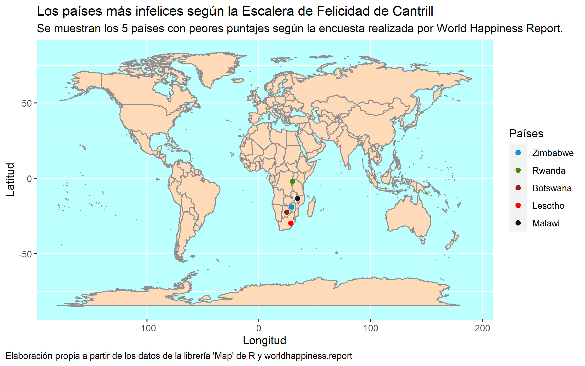
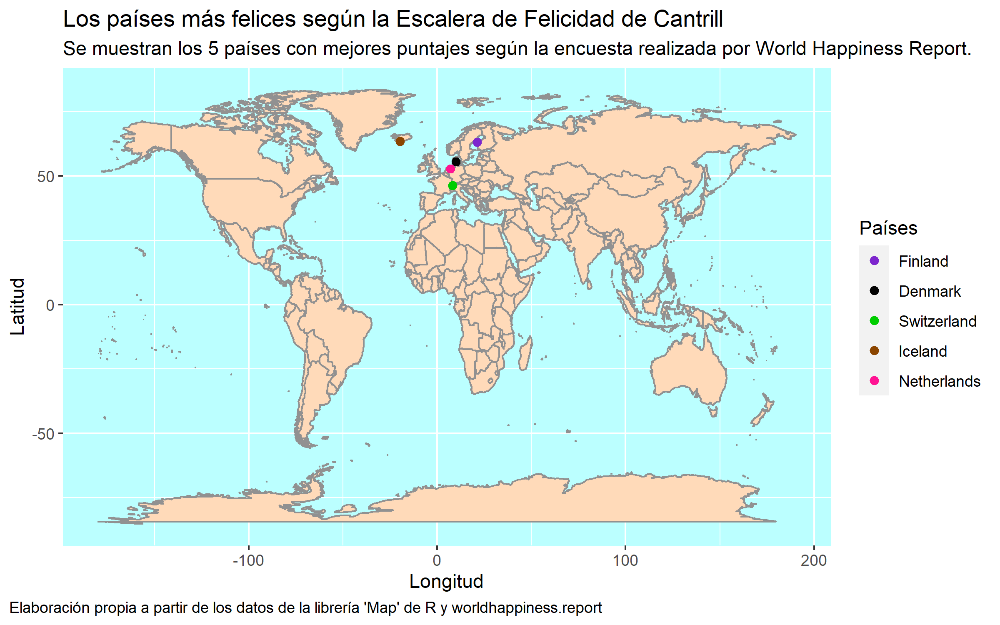

## :memo: Gráficos y Tablas :chart_with_upwards_trend::

A continuación se presentarán los gráficos y tablas que se utilizarán a lo largo de este informe para intentar explicar los factores que podrían influir en el bienestar y felicidad del ser humano en el mundo.

### Gráfico 1 :chart_with_upwards_trend::

### Gráfico 2 :chart_with_upwards_trend::

### Gráfico 3 :chart_with_upwards_trend::

### Gráfico 4 :chart_with_upwards_trend::

### Gráfico 5 :chart_with_upwards_trend::

### Gráfico 6 :chart_with_upwards_trend::

### Gráfico 7 :chart_with_upwards_trend::

### Gráfico 8 :chart_with_upwards_trend::

### Gráfico 9 :chart_with_upwards_trend::

### Gráfico 10 :chart_with_upwards_trend::

### Gráfico 11 :chart_with_upwards_trend::

### Gráfico 12 :chart_with_upwards_trend::

### Tabla 1:memo::

### Tabla 2:memo::

### Tabla 3 :memo::

